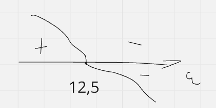
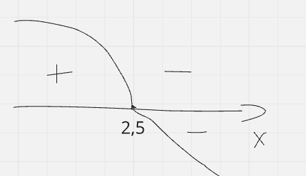
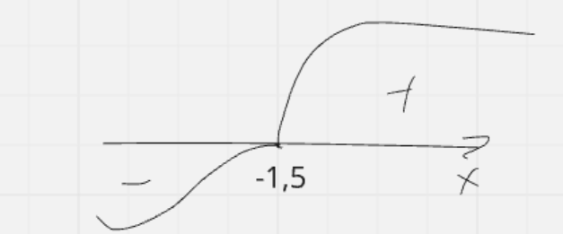
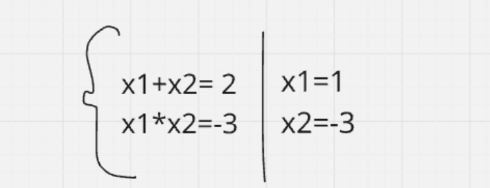
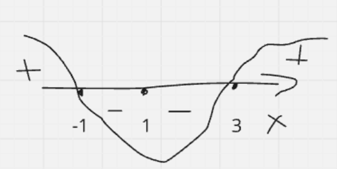

### Zadanie
Funkcja zysku jest dana jako \( P(u) = -2u^2 + 50u - 300 \), gdzie \( u \) to liczba sprzedanych jednostek. Znaleźć liczbę jednostek, które maksymalizują zysk.

### Rozwiązanie
1. Zapisujemy funkcję zysku:
   $$P(u) = -2u^2 + 50u - 300$$

2. Obliczamy pochodną pierwszego rzędu funkcji \( P(u) \) i przyrównujemy ją do zera, aby znaleźć punkty krytyczne:
   $$P'(u) = -4u + 50 = 0$$

3. Rozwiązujemy równanie:
   $$-4u + 50 = 0 \implies -4u = -50 \implies u = 12.5$$

4. Analizujemy znak pochodnej:
   - Gdy \( u < 12.5 \), \( P'(u) > 0 \) (funkcja rośnie).
   - Gdy \( u > 12.5 \), \( P'(u) < 0 \) (funkcja maleje).

   Stąd wynika, że dla \( u = 12.5 \) funkcja osiąga maksimum.

5. Sprawdzamy wartości:
   $$P'(0) = -4(0) + 50 = 50 \quad (\text{funkcja rośnie})$$  
   $$P'(20) = -4(20) + 50 = -30 \quad (\text{funkcja maleje})$$

### Odpowiedź:
Maksymalny zysk osiągany jest dla $$u = 12.5$$ jednostek.

### Zadanie
Masz 10 metrów sznurka i musisz użyć go, aby ogrodzić największy możliwy prostokąt. Znaleźć wymiary tego prostokąta.

### Rozwiązanie
1. Wyrażamy obwód prostokąta:
   $$P = 2(a + b) = 10 \implies a + b = 5$$

2. Niech \( a = x \), wtedy \( b = 5 - x \).

3. Pole prostokąta wynosi:
   $$S = a \cdot b = x \cdot (5 - x) = 5x - x^2$$

4. Obliczamy pochodną funkcji pola \( S \) i przyrównujemy ją do zera:
   $$S' = 5 - 2x = 0$$

5. Rozwiązujemy równanie:
   $$5 - 2x = 0 \implies -2x = -5 \implies x = 2.5$$

6. Obliczamy drugą zmienną:
   $$b = 5 - 2.5 = 2.5$$

7. Analiza pochodnej:
   - \( S'(0) = 5 - 2(0) = 5 \) (funkcja rośnie),
   - \( S'(3) = 5 - 2(3) = -1 \) (funkcja maleje).

   Stąd wynika, że dla \( x = 2.5 \) funkcja osiąga maksimum.

### Odpowiedź:
Największy możliwy prostokąt ma wymiary:  
\( a = 2.5 \), \( b = 2.5 \).

### Zadanie
Znajdź ekstremum funkcji \( f(x) = x^2 + 3x - 5 \).

### Rozwiązanie
1. Wyznaczamy pochodną funkcji \( f(x) \):
   $$f'(x) = 2x + 3$$

2. Przyrównujemy pochodną do zera, aby znaleźć punkty krytyczne:
   $$2x + 3 = 0$$

3. Rozwiązujemy równanie:
   $$2x = -3 \implies x = -1.5$$

4. Analizujemy znak pochodnej, aby określić rodzaj ekstremum:
   - Dla \( x < -1.5 \), \( f'(x) < 0 \) (funkcja maleje).
   - Dla \( x > -1.5 \), \( f'(x) > 0 \) (funkcja rośnie).
   

   Zatem w punkcie \( x = -1.5 \) funkcja osiąga **minimum**.

5. Sprawdzamy wartość funkcji w punkcie ekstremum:
   $$f(-1.5) = (-1.5)^2 + 3(-1.5) - 5 = 2.25 - 4.5 - 5 = -7.25$$

### Odpowiedź:
Funkcja \( f(x) \) osiąga minimum w punkcie \( x = -1.5 \), a wartość minimalna wynosi \( f(-1.5) = -7.25 \).

### Zadanie
Znajdź ekstremum funkcji:
$$f(x) = \frac{x^2 + 2x + 1}{x - 1}.$$

### Rozwiązanie

1. Funkcja to iloraz dwóch wyrażeń, więc pochodną obliczamy za pomocą wzoru na pochodną ilorazu:
   $$\left(\frac{u}{v}\right)' = \frac{u' \cdot v - u \cdot v'}{v^2},$$
   gdzie:
   $$u = x^2 + 2x + 1, \quad v = x - 1.$$

2. Obliczamy pochodne:
   $$u' = 2x + 2, \quad v' = 1.$$

3. Pochodna funkcji:
   $$f'(x) = \frac{(2x + 2)(x - 1) - (x^2 + 2x + 1)(1)}{(x - 1)^2}.$$

4. Upraszczamy licznik:
   $$f'(x) = \frac{(2x^2 - 2x + 2x - 2) - (x^2 + 2x + 1)}{(x - 1)^2},$$
   $$f'(x) = \frac{2x^2 - 2 - x^2 - 2x - 1}{(x - 1)^2},$$
   $$f'(x) = \frac{x^2 - 2x - 3}{(x - 1)^2}.$$

5. Licznik zerujemy, aby znaleźć punkty krytyczne:
   $$x^2 - 2x - 3 = 0.$$

6. Rozwiązujemy równanie kwadratowe:
   $$x_1 + x_2 = 2, \quad x_1 \cdot x_2 = -3.$$

   

   Korzenie równania:
   $$x_1 = -1, \quad x_2 = 3.$$

7. Analizujemy znaki pochodnej:
   - Dla $$x = -1$$: funkcja osiąga **maksimum**.
   - Dla $$x = 3$$: funkcja osiąga **minimum**.
   
   

### Odpowiedź:
- Ekstremum maksymalne: $$x = -1,$$
- Ekstremum minimalne: $$x = 3.$$
