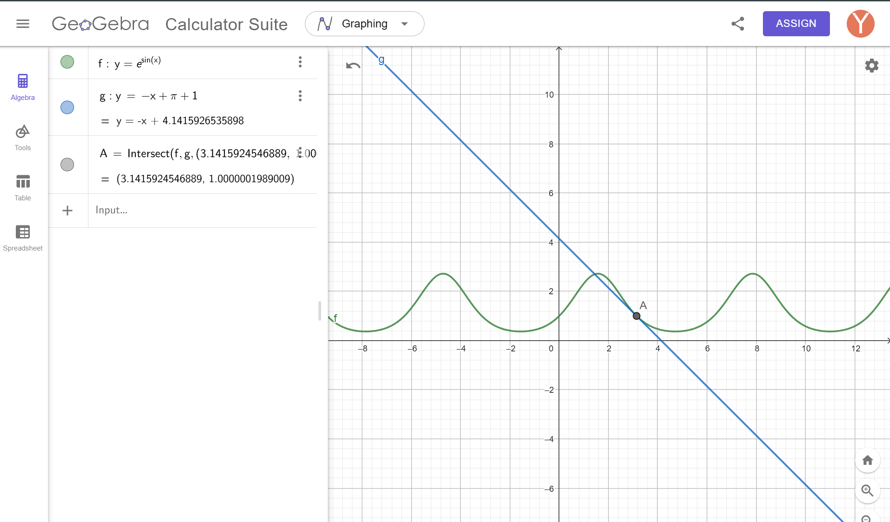

### Zadanie
Wyznacz równanie stycznej do wykresu funkcji w punkcie $$x_0 = \pi$$ dla funkcji:
$$y = e^{\sin(x)}.$$

### Rozwiązanie

Równanie stycznej do wykresu funkcji:
$$y = f'(x_0)(x - x_0) + y_0,$$
gdzie:
- $$y_0 = f(x_0),$$
- \(f'(x_0)\) to pochodna funkcji w punkcie \(x_0\).

1. Funkcja:
   $$y = e^{\sin(x)}.$$

2. Pochodna funkcji:
   $$y' = e^{\sin(x)} \cdot \cos(x).$$

3. Obliczamy wartość pochodnej w punkcie $$x_0 = \pi$$:
   $$f'(x_0) = e^{\sin(\pi)} \cdot \cos(\pi) = e^0 \cdot (-1) = -1.$$

4. Obliczamy wartość funkcji w punkcie $$x_0 = \pi$$:
   $$y_0 = e^{\sin(\pi)} = e^0 = 1.$$

5. Podstawiamy wartości do równania stycznej:
   $$y = -1 \cdot (x - \pi) + 1,$$
   $$y = -x + \pi + 1.$$

### Odpowiedź:
Równanie stycznej to:
$$y = -x + \pi + 1.$$

# Завдання

Обчислити розклад функції \( f(x) = \cos(x) \) у ряд Тейлора навколо точки \( x_0 = 0 \) до членів порядку \( x^4 \). А також розглянути функцію \( h(x) = \frac{1}{1 - x^3} \), знайти її значення і похідні в точці \( x_0 = 0 \).

## 1. Розклад функції \( f(x) = \cos(x) \) у ряд Тейлора

Формула ряду Тейлора:
$$
f(x) = f(0) + f'(0)x + \frac{f''(0)x^2}{2!} + \frac{f'''(0)x^3}{3!} + \frac{f^{(4)}(0)x^4}{4!} + \dots
$$

### Обчислення похідних у точці \( x_0 = 0 \):
- \( f(x) = \cos(x) \), \( f(0) = 1 \)
- \( f'(x) = -\sin(x) \), \( f'(0) = 0 \)
- \( f''(x) = -\cos(x) \), \( f''(0) = -1 \)
- \( f'''(x) = \sin(x) \), \( f'''(0) = 0 \)
- \( f^{(4)}(x) = \cos(x) \), \( f^{(4)}(0) = 1 \)

### Розклад:
$$
f(x) = 1 - \frac{x^2}{2!} + \frac{x^4}{4!} + \dots
$$
$$
f(x) = 1 - \frac{x^2}{2} + \frac{x^4}{24}
$$

---

## 2. Функція \( h(x) = \frac{1}{1 - x^3} \)

Обчислити значення \( h(x) \), \( h'(x) \), \( h''(x) \) у точці \( x_0 = 0 \).

### 2.1. Значення функції:
$$
h(0) = \frac{1}{1 - 0^3} = 1
$$

### 2.2. Перша похідна \( h'(x) \):
Формула похідної:
$$
h'(x) = \frac{d}{dx} \left( \frac{1}{1 - x^3} \right) = \frac{(1 - x^3)' \cdot (-1)}{(1 - x^3)^2}
$$
$$
h'(x) = \frac{3x^2}{(1 - x^3)^2}
$$
У точці \( x = 0 \):
$$
h'(0) = \frac{3 \cdot 0^2}{(1 - 0^3)^2} = 0
$$

### 2.3. Друга похідна \( h''(x) \):
Використовуємо похідну частки:
$$
h''(x) = \frac{d}{dx} \left( \frac{3x^2}{(1 - x^3)^2} \right)
$$
Обчислення:
$$
h''(x) = \frac{6x(1 - x^3)^2 - 3x^2 \cdot 2(1 - x^3)(-3x^2)}{(1 - x^3)^4}
$$
У точці \( x = 0 \):
$$
h''(0) = \frac{6 \cdot 0 \cdot (1 - 0^3)^2 - 3 \cdot 0^2 \cdot 2(1 - 0^3)(-3 \cdot 0^2)}{(1 - 0^3)^4} = 2
$$

---

## Відповіді:
1. Розклад функції \( f(x) = \cos(x) \) у ряд Тейлора:
$$
f(x) = 1 - \frac{x^2}{2} + \frac{x^4}{24}
$$
2. Для функції \( h(x) = \frac{1}{1 - x^3} \):
   - \( h(0) = 1 \)
   - \( h'(0) = 0 \)
   - \( h''(0) = 2 \)
